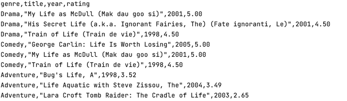

## Movies analytics program

Program analise movies dataset, counts ratings and print top N filtered movies for each genre.

### Program structure

* main.py - execution file
* processor.py - handler file  
* movie.py - movie with films class

### Execution

Program runs using command line or terminal  


**main.py**  

`usage: main.py [-h] [-N N] [-genres GENRES] [-year_from YEAR_FROM] [-year_to YEAR_TO] [-regexp REGEXP]`

**Optional**

| Argument | Help |
| ------------------------ | ----------------------------------- |
|  -h, --help            | show this help message and exit |
|  -N N                  | number of max rating movies |
|  -genres GENRES        | filter by genres |
|  -year_from YEAR_FROM  | number of min year to filter |
|  -year_to YEAR_TO      | number of max year to filter |
|  -regexp REGEXP        | regular expression to filter |


``` sh
python main.py -N 3 -year_to 2007 -year_from 1900 -regexp "Life" -genres "Drama|Comedy|Adventure" -dataset data/ml-latest-small
``` 
