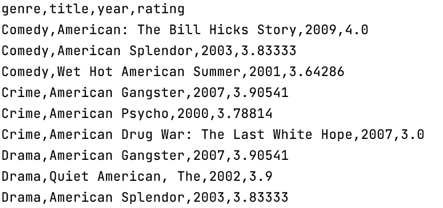

# movies analytics program

Program analise movies dataset and print top N filtered movies for each genre.

### Program structure

* Dockerfile - execution file  
* init.sh - docker entrypoint


## Example
### Running

Program runs using command line or terminal  


`docker build -t ubuntu-movies-analizer .`  
`docker run -d --name="movies-analizer" \
    -e "GIT_PASSWORD=password" \
    ubuntu-movies-analizer`  

****
`docker exec -it movies-analizer python3 /coherent-training-konstantin-zboychik/Task3/main.py [-h] [-N N] [-genres GENRES] [-year_from YEAR_FROM] [-year_to YEAR_TO] [-regexp REGEXP]`

**Optional**

| Argument | Help |
| ------------------------ | ----------------------------------- |
|  -h, --help            | show this help message and exit |
|  -N N                  | number of max movies for each genre |
|  -genres GENRES        | filter by genres |
|  -year_from YEAR_FROM  | number of min year to filter |
|  -year_to YEAR_TO      | number of max year to filter |
|  -regexp REGEXP        | regular expression to filter |


``` sh
docker exec -it movies-analizer python3 /coherent-training-konstantin-zboychik/Task3/main.py -regexp=American -year_from=2000 -year_to=2010 -genres=Comedy,Crime,Drama
``` 
