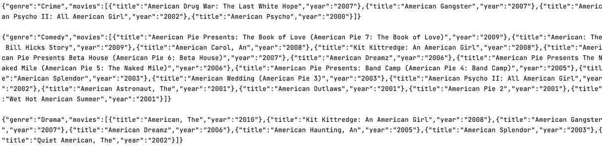

## movies analytics program

Program analise movies dataset and print top N filtered movies for each genre.

### Program structure

* main.sh - execution file  
* mapper.py - mapper
* reducer.py - reducer
* download.sh - bash script to download dataset
* map-reducer.sh - bash script manager

### Execution

Program runs using command line or terminal  


**main.py**  

`usage: ./main.sh [-h] [-N N] [-genres GENRES] [-year_from YEAR_FROM] [-year_to YEAR_TO] [-regexp REGEXP]`

**Optional**

| Argument | Help |
| ------------------------ | ----------------------------------- |
|  -h, --help            | show this help message and exit |
|  -N N                  | number of max movies for each genre |
|  -genres GENRES        | filter by genres |
|  -year_from YEAR_FROM  | number of min year to filter |
|  -year_to YEAR_TO      | number of max year to filter |
|  -regexp REGEXP        | regular expression to filter |


``` sh
./main.sh -regexp=American -year_from=2000 -year_to=2010 -genres=Comedy,Crime,Drama --getfiles
``` 
